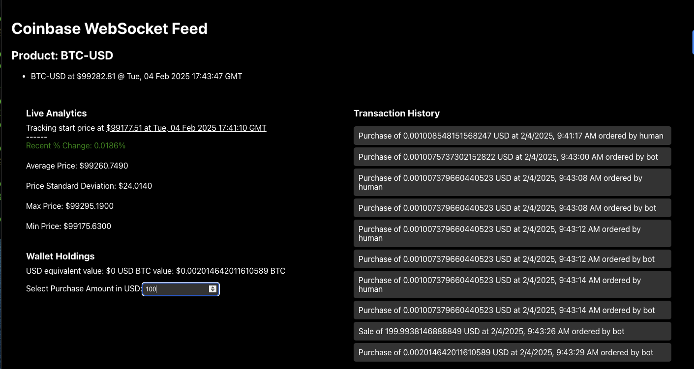
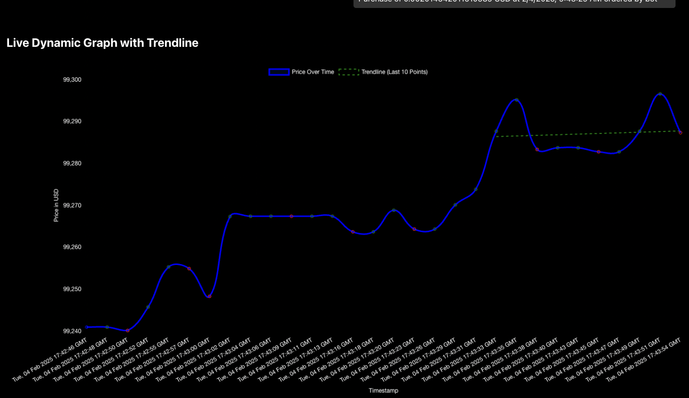

# Crypto Price Tracker (WIP)

A work-in-progress crypto price tracker designed for testing purposes. This project connects to the Coinbase WebSocket API to fetch live crypto price data, displays it on an interactive graph, and provides an option to simulate "trades." The ultimate goal is to use this tool for algorithmic trading strategy testing.

## Features
- **Live Price Tracking:** Real-time price data from the Coinbase WebSocket API.
- **Interactive Graph:** Visualize price changes dynamically using a live tracker graph.
- **Simulated Trades:** Test trade logic by "buying" and "selling" virtual assets.
- **Bot Buy/Sell Behavior:** Automated transactions.
- **Algorithmic Testing (Coming Soon):** Future updates will include support for algorithmic trading strategy tests.

## Technologies Used
- **Frontend:** React.js
- **Charts:** Chart.js (or another library, if applicable)
- **WebSocket Data Feed:** Coinbase WebSocket API
- **Backend (if applicable):** Node.js




## Getting Started

### Prerequisites
Make sure you have the following installed:
- [Node.js](https://nodejs.org/) (v16 or later recommended)
- npm (comes with Node.js)

### Installation
1. Clone the repository:
   ```bash
   git clone https://github.com/your-username/crypto-price-tracker.git
   cd crypto-price-tracker
   ```
2. Install dependencies:
   ```bash
   npm install
   ```

### Run the Project
Start the development server with:
   ```bash
   npm run dev
   ```
This will run the project in development mode. Open [http://localhost:3000](http://localhost:3000) in your browser to view it.

### Simulated Trades
- Use the interface to "buy" or "sell" virtual crypto assets.
- Track your trade history and portfolio value over time.
- This feature is purely for testing and simulation purposes—no real transactions are made.

## Roadmap 
- Implement algorithmic trading tests.
- Expand to include multiple cryptocurrencies.
- Add historical data visualization.

## Contributing
Contributions are welcome! Feel free to fork the repository, make changes, and submit a pull request.

1. Fork the repository.
2. Create your feature branch:
   ```bash
   git checkout -b feature-name
   ```
3. Commit your changes:
   ```bash
   git commit -m "Add some feature"
   ```
4. Push to the branch:
   ```bash
   git push origin feature-name
   ```
5. Open a pull request.

## License
This project is licensed under the MIT License.

Note: This is a work-in-progress project meant for testing and development purposes. It is not suitable for production or real-world trading.
